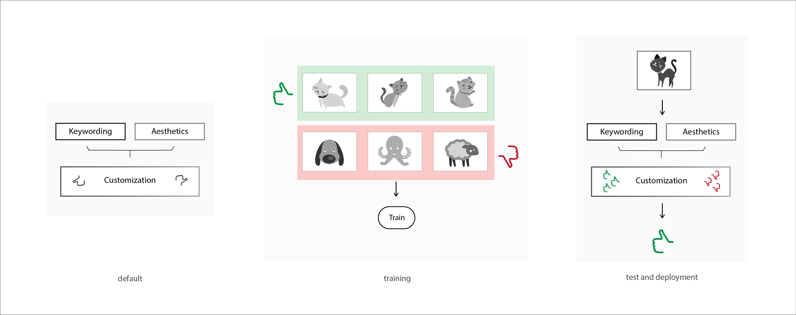

Advanced: Training on Device
=================================

In order to use the customisation module for adding keywords and/or styles, it needs to be trained with handpicked data.

Steps for training:

* features have to be extracted for a list of positive and a list of negative images
* pass extracted features to train function
* repeat training for fine-tuning in order to improve results
* test trained customisation module using the predict function
* save

Feature extraction
-------------------

Training requires a first step which is feature extraction. Features are :java:`float[]`
that are extracted from every image (Bitmap) as follows :

::

  float[] features = MobiusSDK.getCombinedFeatures(bitmap)

Features for training should be extract for positives and negatives and stored
separately in an :java:`ArrayList<float[]>`, so the code would be like the following :

::

  //This can be an computationally expensive task, so it should run in a separate thread
  //Given a list of URIs for positives and negatives
  Arraylist<Uri> UriListPositiveImages... //list of Uri for positives training images
  Arraylist<Uri> UriListNegativeImages... //list of URI for negative training images
  Bitmap bitmap...//Main bitmap to store the current image

  //Example for the positives
  int trainSizePos = UriListPositiveImages.size();
  Arraylist<float[]> trainingFeaturesPos = new ArrayList<>(trainSizePos);
  for (int k = 0; k < trainSizePos; k++){
  loadImageFromFileFromUri(UriListPositiveImages.get(k));
  trainingFeaturesPos.add(k, MobiusSDK.getCombinedFeatures(bitmap));}

Same code for the negatives
::

  int trainSizeNeg = UriListNegativeImages.size();
  Arraylist<float[]> trainingFeaturesNeg = new ArrayList<>(trainSizeNeg);
  for (int k = 0; k < trainSizeNeg; k++){
  loadImageFromFileFromUri(UriListNegativeImages.get(k));
  trainingFeaturesNeg.add(k, MobiusSDK.getCombinedFeatures(bitmap));}

Loading an image from a Uri can be done as follows

::

  private void loadImageFromFileFromUri(Uri uri) {
      try{
          ParcelFileDescriptor parcelFileDescriptor = getContentResolver().openFileDescriptor(uri, "r");
          FileDescriptor fileDescriptor = parcelFileDescriptor.getFileDescriptor();
          bitmap = BitmapFactory.decodeFileDescriptor(fileDescriptor);
          parcelFileDescriptor.close();}
      catch (IOException e){e.printStackTrace();}}

The features should be ideally cached to prevent re-processing the images. The SDK provides a basic serialization interface that can be used to cache a list of features:

::

  SerializableData serializableFeatures = new SerializableData(ArrayList<float[]> listOfFeatures);
  //Use FileOutputStream/ObjectOutputStream to save for example

Training
------------

Once the features are extracted, training can be performed as follows:

::

  //To publish training results override the publishProgress function
  class AsyncTaskTrainingProgressCallback implements TrainingProgressCallback {
      private RunTraining task;
      AsyncTaskTrainingProgressCallback(RunTraining task) {this.task = task;}
      @Override
      public void publishProgress(int progress) {
          try {task.publishProgress(progress);}
          catch (Exception e) {e.printStackTrace();}
      }
  }

  //If it's called inside an AsyncTask
  protected Void doInBackground(Void... VoidInput) {
    //MobiusSDK.resetCustomModel(customModelKey);
    //If you want to reset the model, otherwise it does fine-tuning
    MobiusSDK.trainCustomModel(customModelKey, trainingFeaturesPos, trainingFeaturesNeg, new AsyncTaskTrainingProgressCallback(this));
    return null;}

|model| saving and naming
---------------------------

.. todo::

  Naming is currently still missing here

The |model| can be saved as follows :

::

  Boolean success = MobiusSDK.saveCustomModel(customModelKey, getFilesDir().getPath() + "/" + CustomModelFileName);

Deployment
-----------

Once the |model| is trained, it can be used in the same manner as a pre-trained |model|
by calling the :java:`predictCustomModel` function, which returns a result object.

::

  CustomModelResult result = MobiusSDK.predictCustomModel(customModelKey, float[] features);
  float predictedScore = result.getScore(); //returns score between 0 and 1
  bool classifciationResult = result.classify(); //returns boolean value if query belongs to custom class
