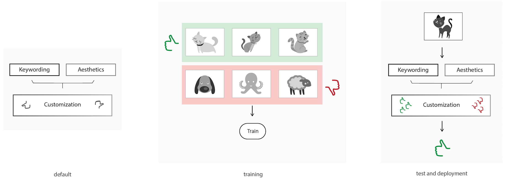

Customized Training
=================================

In order to use the customisation module for adding keywords and/or styles, it needs to be trained with handpicked data.

The steps required for training are:

* add positive and negative examples
* run training
* repeat training for fine-tuning in order to improve results
* test trained customisation module using the predict function

Adding positive and negative samples
-------------------------------------

To add images to SDK send POST request to the following endpoint.
::

  curl http://webdemo.mobius.ml/test_api/add/<type>/<custom_model_id>?MOBIUS_KEY=<your_key> -X POST -F "data=@./your_img.jpg"

where type is type of the sample (can be only either 'positive' or 'negative') and custom_model_id is an integer from 1.

Usually you can train only one custom model per the key. In case you want to train more than one model contact our sales team by e-mail sales@mobius.ml.

If you want to add images for the custom model with id = 1 then you can do like this:

::

  curl http://webdemo.mobius.ml/test_api/add/<type>?MOBIUS_KEY=<your_key> -X POST -F "data=@./your_img.jpg"

.. note::

Below is an example on how to do add multiple samples at the same time using Python.
::

    from multiprocessing import Pool
    import requests
    import os
    import fnmatch

    #Function that adds one sample to the training data
    def add_sample((img, sample_type, custom_model_id)):
      with open(img, 'rb') as image:
        data = {'data': image}
        r = requests.post('http://webdemo.mobius.ml/test_api/add/%s/%d?MOBIUS_KEY=<your_key>' % (sample_type, custom_model_id), files=data).json()
      return r

This example shows how to add positive and negative samples to the customized training. In the example, we want to train a
#filter for people. Hence, the positive samples are all the images with people; the negative samples will be the other images.

::

    path_to_positives = '/your_image_folder/Positives/' #Put positive samples in here
    path_to_negatives = '/your_image_folder/Negatives/' #Put negative samples in here
    custom_model_id = 1

    #Get all the paths to the images
    pos_image_names = [path_to_positives + name for name in fnmatch.filter(os.listdir(path_to_positives), '*.jpg')]
    neg_image_names = [path_to_negatives + name for name in fnmatch.filter(os.listdir(path_to_negatives), '*.jpg')]

    #Merge the two lists so that they can be passed to the pool.map() function.
    images = [(item, 'positive', custom_model_id) for item in pos_image_names] + [(item, 'negative', custom_model_id) for item in neg_image_names]

    pool = Pool(50)
    r = pool.map(add_sample, images)
    pool.close()
    pool.join()

Training
------------

To run training, you can send a GET request to the following endpoint:
::

  curl http://webdemo.mobius.ml/test_api/train/<custom_model_id>?MOBIUS_KEY=<your_key>

If you want to add images for the custom model with id = 1 then you can do like this:
::

  curl http://webdemo.mobius.ml/test_api/train?MOBIUS_KEY=<your_key>

The following request will return a json file with field task_id that can be used to get status of training:
::

  curl http://webdemo.mobius.ml/test_api/status/<task_id>?MOBIUS_KEY=<your_key>

Prediction from Images
-----------------------

To get the prediction of a custom model with id = custom_model_id, you can call the following endpoint:
::

  curl http://webdemo.mobius.ml/test_api/predict/custom/<custom_model_id>?MOBIUS_KEY=<your_key> -X POST -F "data=@./your_img.jpg"

If you want to add images for the custom model with id = 1 then you can do like this:
::

  curl http://webdemo.mobius.ml/test_api/predict/custom?MOBIUS_KEY=<your_key> -X POST -F "data=@./your_img.jpg"

In python:
::

  def get_custom_predictions(img, custom_model_id=1):
     with open(img, 'rb') as image:
         data = {'data': image}
         pred = requests.post('http://http://webdemo.mobius.ml/test_api/predict/custom/%d?MOBIUS_KEY=<your_key>'% custom_model_id, files=data).json()
     return pred