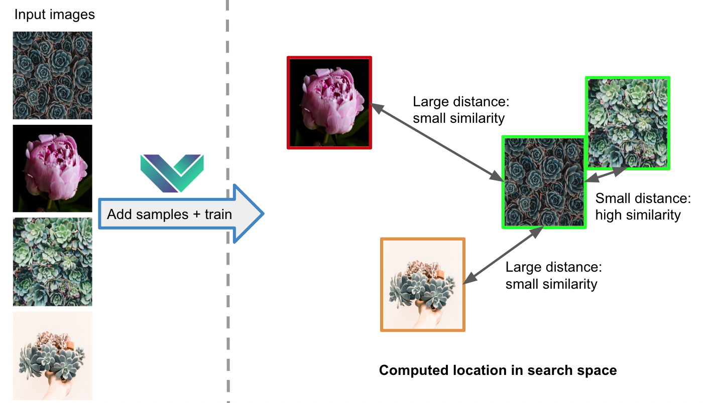

Advanced: Similarity Search
=================================

Overview and Work Flow
------------------------
Mobius Vision SDK provides a powerful similarity search that is easy to set up. In the first part, we detail the steps required to setting up a new image database, and train a similarity search approximator to enable fast and scalable similarity search in large image databases. We also show how new images can be efficiently added to an existing image database, without having to retrain the whole similarity search approximator.

The following illustration shows a simplified view of how the similarity search works.

Getting Started
--------------

## Adding Images to the Image Database

The first step is to add images to the docker volume by sending a POST request to the following endpoint:
::

  curl 127.0.0.1:5000/similarity/add?id=<unique_id> -X POST -F "data=@./your_img.jpg"

where id is an optional argument. Without this argument, the system will generate a random ID number and return it as a response.

.. note::

  The IDs for image samples should be unique, since they are used internally to identify the images. We recommend either using numbers, or a combination of numbers and letters. They should be passed as a string.

You can also add samples using the following python script:
::

  def add_sample(img_path, ID):
    with open(img_path, 'rb') as image:
        data = {'data': image}
        r = requests.post('http://127.0.0.1:5000/similarity/add?id=%s' % ID, files=data).json()
    return r
    
Lastly, here is an example how to use multiprocessing in python to speed things up:
::

  from multiprocessing import Pool
  import requests

  def add_sample(img_path, ID):
    with open(img_path, 'rb') as image:
        data = {'data': image}
        r = requests.post('http://127.0.0.1:5000/similarity/add?id=%s' % ID, files=data).json()
    return r

  pool = Pool(50)
  images = [path_to_image1, path_to_iamge2, ...] #List of image paths
  results = pool.map(add_sample, images)
  pool.close()
  pool.join()

When images are added to the database, the SDK processes them by extracting numerical features according to our pre-trained Mobius Vision keywording model. All processed samples are stored in an auxiliary structure.

.. warning::

  This step is computationally expensive. If the number of images is large (e.g., more than 1 million), it may take more than one day to process all images on a single GPU.

## Training Similarity Search Approximator

Once all images have been added to the image dataset, the numerical features extracted in the last step have to be further processed in order to scale to large datasets. Furthermore, the so-called "similarity search approximator" enables fast search and adaptation to the provided image data.

To train the similarity search approximator, send a GET request to the following endpoint:
::

  curl 127.0.0.1:5000/similarity/train

.. note::

  For a successful similarity search approximator training, you should add at least 1 000 images. However, we recommend to use at least 100 000 images for optimal results.

The request above will return a json file with the field task_id. The following command shows how the task_id can be used to get the status of the training:
::

  curl 127.0.0.1:5000/similarity/status/<task_id>

The following error messages could appear:

* *'need more samples'*: the number of samples is less than 1 000
* *'no samples'*: no samples have been added for training
* *'no index, train first'*: update function can only be called after one training has been carried out

.. note::

  Although this process is quite fast, it may take several hours to process all images for large image collections.

Searching for Similar Images
----------------------------

Please ensure that you have successfully completed the "getting started" before reading on. That is, you should have added images to the docker volume, and trained the similarity search approximator for all images in the database. If this is the case, you are ready to run the similarity search.

Similarity search with a query image can be used with the following endpoint:
::

  curl 127.0.0.1:5000/similarity/search -X POST -F "data=@./your_query_img.jpg"

Or using this call from a python script:
::

  def search(img_path):
      with open(img_path, 'rb') as image:
          data = {'data': image}
          r = requests.post('http://127.0.0.1:5000/similarity/search', files=data).json()
      return r

.. note::

  This search call is very fast and should generally run in less than 1 second.

The output is split into three parts:

* A list of distances in floating point precision that quantifies the similarity to the most similar images found. Since lower distance implies higher similarity, this list is sorted in ascending order.
* A list of image IDs (as specified when images were added to the image database) of the most similar images, sorted the same way as the first list.
* A status message, which says 'ok' if no error occurred in the search, and 'error' otherwise.

Example of an output
::

  {
      'dist': [349.9123229980469, 363.0243835449219, 501.1552734375, 519.2177734375, 576.5772705078125, 663.9130859375, 667.498291015625, 671.4913940429688, 684.84228515625, 705.6535034179688],
      'result': ['1260', '140', '1267', '1685', '866', '1173', '583', '105', '4', '154'],
      'status': u'ok'
  }

In the example, the image with ID 1260 is the most similar to the query image provided, with a distance of 349.912.

You can control the number of similar images returned by the environment variable SIMILARITY_SEARCH_NUM_RESULTS (use -e option for docker). The default value is set to 10.

.. note::

  You can use the environment variable NPROB to balance between speed and accuracy. Its value has to be an integer between 1 and 100 (smaller value means faster search, with less accurate results). The recommended (default) value is 5.

Extending an existing Image Database
------------

It might be desired to add more images to the image database in a running system. This section details the required steps to this this in an efficient manner. In particular, we provide an update function  this case, one can use the update function that preserves previously added images in the index, and adds the new images without retraining the images that are already in the image database.

## Adding Images to the Image Database

The first step consists of adding the new images to the image database. This step is identical to the one explained above. That is, the images are added to the docker volume by sending a POST request to the following endpoint:
::

  curl 127.0.0.1:5000/similarity/add?id=<unique_id> -X POST -F "data=@./your_img.jpg"

where id is an optional argument. Without this argument, the system will generate a random ID number and return it as a response.

## Updating the Similarity Search Approximator

Once all the desired images have been added, one has to update the similarity search approximator. This can be done by sending a GET request to the following endpoint.
::

  curl 127.0.0.1:5000/similarity/update

The request above returns a json file with a task_id, which can be used to get status of updating process:
::

  curl 127.0.0.1:5000/similarity/status/<task_id>

.. warning::

  This step is very IO heavy. If the number of images is very large (e.g., more than 1 million), it may take several hours to process all images.

Once the update of the similarity search approximator is complete, the similarity search will be performed on all images of the extended image database.
