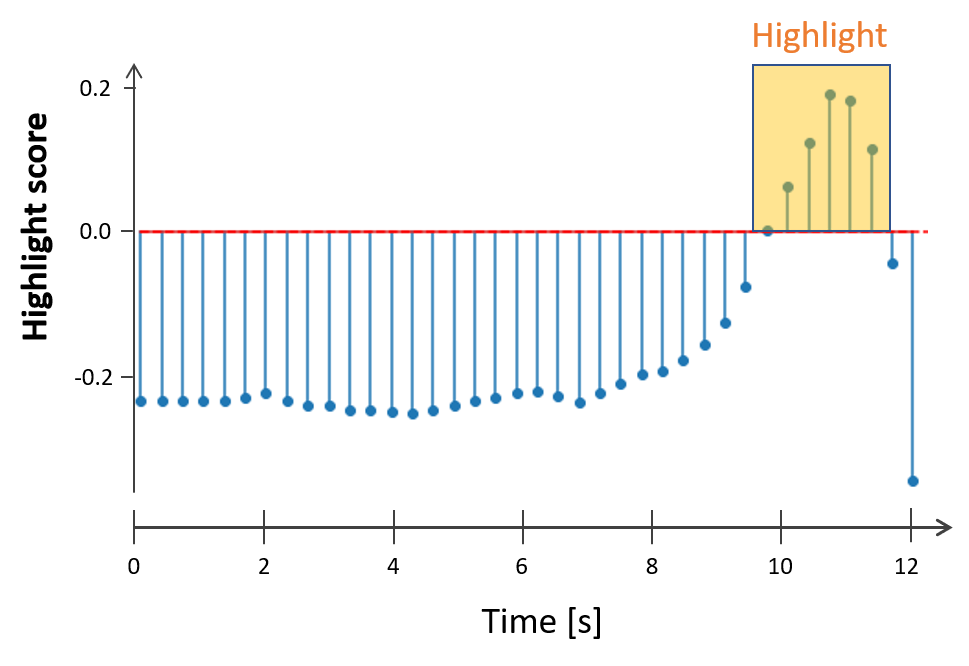

Video Highlighting
====================
This feature allows to obtain 'highlight scores' for video segments, which can be used to identify the most important parts of a video. This can be very useful for example in order to create a summary of a video that can be shown if someone is browsing through a video database, or to identify the highlights in a recording of unedited video.

For illustration purposes we show an example of a video that can benefit from highlighting. Someone is standing on the side of a motocross race, waiting for the race to start. 

.. raw:: html
    
    

    <video controls src="_static/video_highlight_motostart.mp4" width="50%"></video>
    

Our highlight detector is able to identify the point where the race actually starts, as identified by the spike of the highlight scores towards the end of the clip. 

   

Below is the section of the video that corresponds to the identified highlight. Note that depending on the length and type of video, there can be numerous (or none) highlights detected by our highlights detector.
   
   

Getting started
---------------

In the following, we show an example of how to obtain highlight scores for a video.

First, we need to send the video to the (local) vision server for analysis.
::

  curl 127.0.0.1:5000/video/tag -X POST -F "data=@./your_video.mp4"

The above command will return an information message:
::

  {"message":"video_tagging","status":"ongoing","task_id":"599600ef-817f-413e-85f5-d4fc55313164"}

The **task_id** will be required in the next step.
  

With the following command, you can check the status of the process at any time. 
::
  
  curl 127.0.0.1:5000/status/<task_id>
  
where you would replace <task_id> with 599600ef-817f-413e-85f5-d4fc55313164 in the example above. 

If the video is still being processed, the status message will be:
::
  
  {"status": "ongoing", "message": "video_tagging"}
  
When the processing is finished, the status message will contain the highlight scores (per frame), as well as suggested timestamps which form the highlight segments. In the example below, the frame extraction rate was set to the (default) 3 frames per second (3 fps), and hence the timestamps of the per-frame highlight scores increase in increments of 1/3 of a second.
::
  
  {"status": "success", "highlighting": {"segments": [{"timestamp": [10.0, 12.333333333333334], "score": 0.20445691049098969}, {"timestamp": [3.6666666666666665, 8.333333333333334], "score": -0.2019532024860382}, {"timestamp": [0.0, 3.3333333333333335], "score": -0.20677834749221802}], "scores": [[0.0, -0.1992284506559372], [0.3333333333333333, -0.20936289429664612], [0.6666666666666666, -0.20502197742462158], [1.0, -0.20870591700077057], [1.3333333333333333, -0.2060716450214386], [1.6666666666666667, -0.20339933037757874], [2.0, -0.2079032063484192], [2.3333333333333335, -0.2217179536819458], [2.6666666666666665, -0.22511234879493713], [3.0, -0.22476939857006073], [3.3333333333333335, -0.22366167604923248], [3.6666666666666665, -0.2187650054693222], [4.0, -0.22058136761188507], [4.333333333333333, -0.21972207725048065], [4.666666666666667, -0.2137240320444107], [5.0, -0.21092268824577332], [5.333333333333333, -0.20621028542518616], [5.666666666666667, -0.1963074952363968], [6.0, -0.19618019461631775], [6.333333333333333, -0.20195922255516052], [6.666666666666667, -0.20934005081653595], [7.0, -0.19561068713665009], [7.333333333333333, -0.1895851492881775], [7.666666666666667, -0.17658250033855438], [8.0, -0.16593295335769653], [8.333333333333334, -0.16475892066955566], [8.666666666666666, -0.14341069757938385], [9.0, -0.11771498620510101], [9.333333333333334, -0.0556693896651268], [9.666666666666666, 0.01879364624619484], [10.0, 0.08431927114725113], [10.333333333333334, 0.13425672054290771], [10.666666666666666, 0.20124955475330353], [11.0, 0.19689522683620453], [11.333333333333334, 0.2272009700536728], [11.666666666666666, 0.24720890820026398], [12.0, 0.2757335305213928], [12.333333333333334, 0.2994374632835388]]}}

.. note::
    
    In the current implementation, we return all (highlight segments) based on a heuristic, irrespective of the absolute value of the segment score. This can be seen in the example above, where there really is only one highlight.
    
    

Arguments
----------

Depending on the features that have been bought, there are a number of arguments that can be passed. The arguments can be passed by adding a "?" after the tag command, followed by the argument=value. Several arguments are separated using the "&". The following example illustrates how the frame extraction rate (e.g., how many frames are analyzed per second of video) can be changed:
::
  
  curl 127.0.0.1:5000/video/tag?num_fps=6 -X POST -F "data=@./your_video.mp4"
  

Prediction in Python
---------------------

The code snipped below shows how prediction can be done in Python.

::

    import time
    
    def analyze_video(video_path):
         with open(video_path,'rb') as video:
             data = {'data': video}
             res = requests.post('http://127.0.0.1:5000/video/tag', files=data).json()
             task_id = res['task_id']
             msg = requests.get('http://127.0.0.1:5000/status/' + task_id).json()
             
             while(msg['status'] is 'ongoing'):
                 msg = requests.get('http://127.0.0.1:5000/status/' + task_id).json()
                 time.sleep(1.0)
                 
             if(msg['status'] == 'success'):
                pred = msg['result']
             else:
                pred = msg['status']
        
        return pred

  
